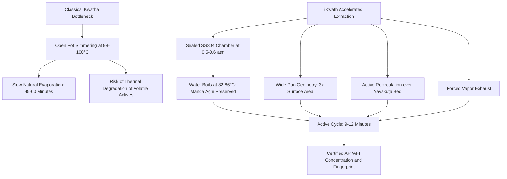
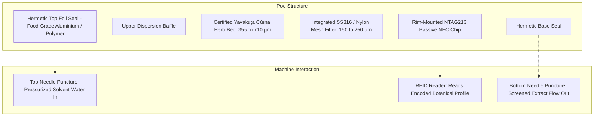
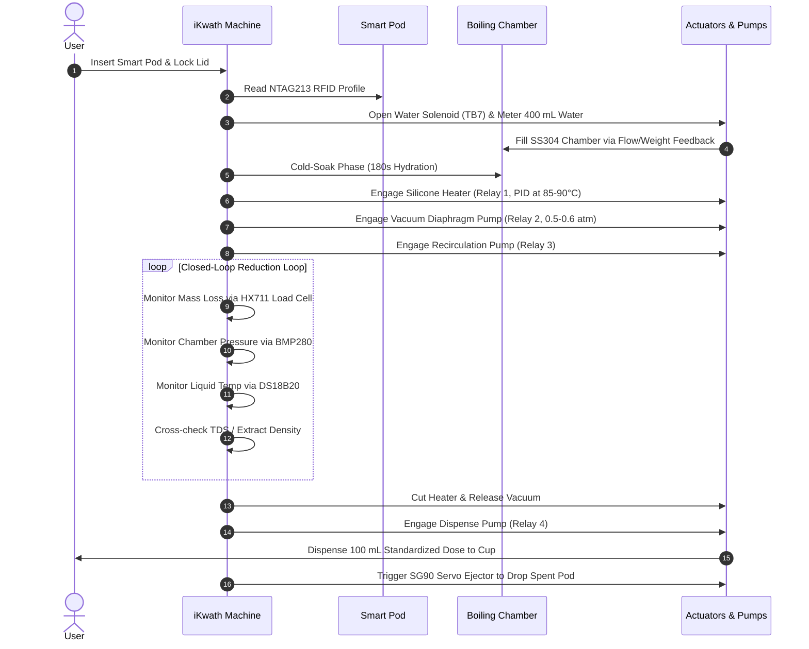
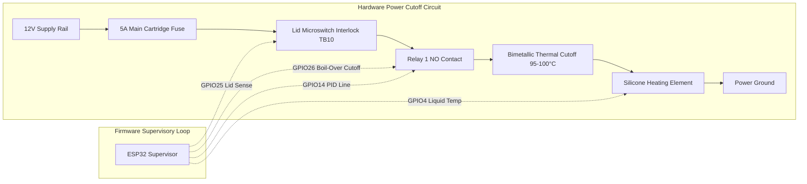
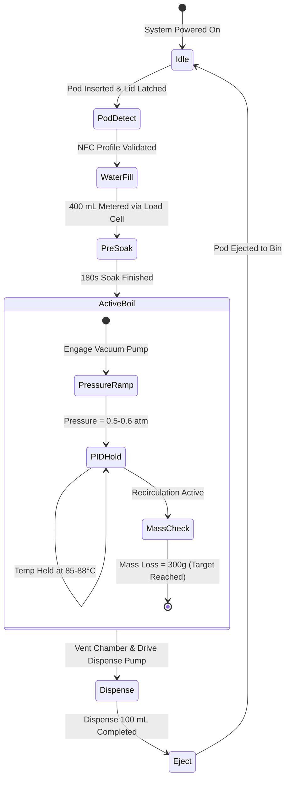
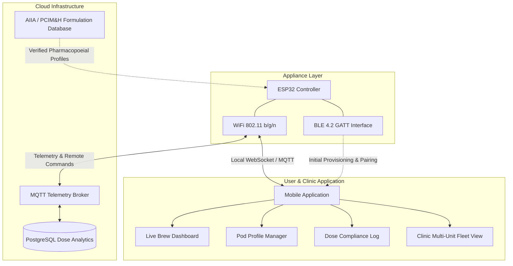

# iKwath: Smart Pod-Based Ayurvedic Decoction Appliance

**Problem Statement ID:** 26048  
**Problem Statement Title:** iKwath - a pod-based smart Kwatha (Kadha) maker that prepares a fresh, AFI/API-standardized decoction from coarse powder (yavakuṭa cūrṇa) on demand, in the shortest practical time without altering the decoctions quality or yield  
**Sponsoring Organization:** Ministry of Ayush / All India Institute of Ayurveda (AIIA)  
**Category:** Hardware / MedTech / BioTech / HealthTech  

---

## 1. Executive Summary and Problem Domain

Kwatha (also known as Kashaya or Kadha) is the primary aqueous decoction dosage form in Ayurvedic medicine. It is prepared by boiling coarse herbal powder (yavakuṭa cūrṇa) in specified multiples of water until concentrated down to a fraction of the original volume (classically 1/4th volume reduction), followed by immediate filtration.

Unlike shelf-stable hydroalcoholic preparations (Asava/Arishta) or churna tablets, a classical Kwatha contains no artificial preservatives and possesses an active therapeutic lifespan of only a few hours after extraction before biological and chemical degradation sets in. Modern consumers and OPD clinics typically avoid traditional preparation because atmospheric evaporation requires 45 to 60 minutes of labor-intensive, monitored simmering. Consequently, patients resort to bottled, industrially preserved syrups that undergo thermal degradation or suffer from inconsistent extractive yields.

iKwath resolves this challenge by modernizing Kwatha preparation into an automated, countertop, single-dose extraction device. Utilizing single-use pods containing certified yavakuṭa cūrṇa, closed-loop sub-100°C vacuum-assisted evaporation, active fluid recirculation, continuous load-cell mass tracking, and inline extract density monitoring, iKwath compresses the decoction cycle down to 9–12 minutes without exceeding the pharmacopoeial temperature ceiling of 85–90°C.

---

## 2. Pharmacopoeial Identity and Extraction Physics

### 2.1 The Ayurvedic Pharmacopoeia of India (API) Mandate
The Ayurvedic Pharmacopoeia of India (API) and Ayurvedic Formulary of India (AFI) define Kwatha preparation parameters by botanical hardness:

| Herb Hardness Class | Botanical Parts | Water Ratio (w/w) | Target Reduction | Target Dose Ratio |
|---|---|---|---|---|
| Soft (Mridu) | Leaves, flowers, whole tender herbs | 16 parts | Reduce to 1/4 | ~4x concentration |
| Medium (Madhyama) | Barks, stems, soft wood | 8 parts | Reduce to 1/4 | ~2x concentration |
| Hard (Kathina) | Roots, dense heartwood | 4 parts | Reduce to 1/4 | ~1x concentration |

For outpatient formulary use, the standard working profile takes 400 mL of water and reduces it to a 100 mL therapeutic dose (a 4:1 volumetric reduction) from a standard dose pod.

### 2.2 Yavakuṭa Cūrṇa Particle Size Standard
Per PCIM&H specification AFI/2020/KC/1.0:
- **Pass Through:** 100% must pass through IS Sieve No. 22 (710 µm aperture).
- **Retained Coarse Fraction:** Not more than 10% passes through IS Sieve No. 44 (355 µm aperture).
- **Extraction Rationale:** Coarse granulate ensures solvent penetration through fractured cell walls without forming an impermeable bed or releasing ultra-fine colloidal mud that would choke mesh filters and contaminate the clear decoction.

### 2.3 The Temperature Ceiling vs. Evaporation Rate Dilemma
Ayurvedic texts dictate extraction under *Manda Agni* (gentle, sub-boiling heat). At or above 100°C, volatile terpenes, thermolabile glycosides, and phenolic fractions degrade. 

To reduce cycle duration from 45 minutes to under 12 minutes without exceeding 85–90°C, iKwath manipulates the remaining physical variables of evaporation kinetics:
1. **Reduced Pressure (Vacuum Depressed Boiling):** Operating the sealed brew chamber under a partial vacuum of 0.50–0.60 atm (50–60 kPa absolute) drops the physical boiling point of water to exactly 81–86°C. The liquid boils vigorously, generating rapid steam bubbles and convection currents while liquid temperature remains strictly within the 85–90°C safety envelope.
2. **Aspect Ratio and Surface Area:** Replacing a traditional tall, narrow vessel (50 cm² evaporative area) with a wide, shallow stainless-steel pan (150–200 cm² evaporative area) triples the vapor release interface.
3. **Boundary Layer Stripping:** A low-noise dry-zone exhaust blower continuously pulls humid air away from the liquid meniscus to prevent vapor saturation.
4. **Active Recirculation:** A food-grade pump continuously forces liquid over the submerged pod bed, eliminating diffusion boundary layers and preventing localized hot-spots.



---

## 3. Pod Architecture and Authentication

The iKwath pod acts simultaneously as a pre-measured hermetic storage unit and an active in-chamber extraction filter.



### 3.1 Mechanical and Mesh Specification
- **Volume Capacity:** 25 g to 35 g dry coarse herb charge.
- **Mesh Porosity:** 150–250 µm aperture, preventing particulate migration (>355 µm) into the finished drink while maintaining high flow rates during recirculation.
- **Biocompatibility:** Polypropylene (PP) food-grade shell or pressed cellulose, completely BPA-free, rated for continuous exposure to 100°C aqueous environments.

### 3.2 Dynamic Profile Encoding via NTAG213 NFC
Every pod contains a high-frequency (13.56 MHz) NTAG213 chip on its outer rim. When seated into the chamber, the appliance's MFRC522 reader decodes the encrypted formulation payload:
- **Formulation ID:** Unique batch code cross-referenced with AIIA/PCIM&H repositories.
- **Herb Class Ratio:** Soft (16:1), Medium (8:1), or Hard (4:1) starting water volume.
- **Pre-Soak Time:** 180 to 300 seconds for botanical swelling and cellular hydration.
- **Target Reduction Mass:** Grams of evaporated mass required before cycle completion.
- **Temperature Profile:** Target setpoint (85°C to 88°C).
- **Target Extract Density:** Calibrated TDS/Brix threshold for dose validation.

---

## 4. Machine Fluidics and Working Principle

The iKwath appliance operates in eight distinct physical phases:



### 4.1 Step-by-Step Cycle Mechanics
1. **Pod Loading and Interlock:** The user inserts the pod. A limit switch confirms positive closure, and a 12V latch solenoid locks the lid to withstand pressure differentials.
2. **Metered Water Intake:** Relay 5 energizes the 12V inlet solenoid. Exactly 400 mL (or profile-specified volume) of filtered water is pumped from the rear tank into the chamber, verified by the HX711 load cell.
3. **Pre-Soak Hydration:** The herb remains submerged in ambient/warm water for 3 minutes. This softens the botanical matrix, opens plant pores, and accelerates extraction kinetics.
4. **Controlled Vacuum Boiling:** 
   - Relay 1 activates the 12V 50W silicone heating pad via low-side MOSFET/PID control.
   - Relay 2 activates the food-grade diaphragm vacuum pump. The BMP280 sensor monitors chamber depressurization to ~55 kPa.
   - Water reaches a rolling boil at ~85°C.
5. **Continuous Recirculation and Vapor Stripping:**
   - Relay 3 drives the peristaltic/impeller pump, drawing liquid from the bottom and spraying it back over the pod bed.
   - Relay 7 drives the 40mm exhaust blower to purge saturated vapor out of the dry-zone condenser exhaust duct.
6. **Mass-Reduction Endpoint Detection:** The load cell continuously monitors the weight of the floating boiler assembly. Once 300 g (±2 g) of solvent has evaporated, the MCU registers completion.
7. **Filtration and Dispensing:** Relay 4 engages the dispense pump, pulling the finished decoction through the pod's bottom mesh filter and dispensing ~100 mL into the user's cup at 55–60°C.
8. **Automated Ejection:** A dedicated SG90 micro-servo actuator trips the mechanical pod catch, dropping the spent pod into the lower waste bin.

---

## 5. Dual-PCB Hardware Architecture

The electronics are partitioned into two physically separate boards to isolate sensitive analog instrumentation from inductive relay switching noise.

```mermaid
graph LR
    subgraph AC Mains & Power Board
        AC[220V AC Input] --> PS1[Enclosed 12V 5A AC-DC Supply]
        PS1 --> F1[5A DC Fuse]
        F1 --> 12V[12V High Current Bus]
        12V --> BUCK[LM2596 Buck Regulator]
        BUCK --> 5V[Regulated 5V Supply]
        12V --> RLY1[Relay 1: Heater Pad]
        12V --> RLY2[Relay 2: Vacuum Pump]
        12V --> RLY3[Relay 3: Recirculation Pump]
        12V --> RLY4[Relay 4: Dispense Pump]
        12V --> RLY5[Relay 5: Water Inlet Solenoid]
        12V --> RLY6[Relay 6: Lid Lock Solenoid]
        12V --> RLY7[Relay 7: Exhaust Fan]
    end

    subgraph Control Board
        MCU[ESP32 DevKit V1]
        5V --> MCU
        MCU --> DS[DS18B20 Temp Probe]
        MCU --> HX[HX711 24-Bit ADC + Load Cell]
        MCU --> NFC[MFRC522 RFID Reader]
        MCU --> I2C[I2C Bus]
        I2C --> OLED[SSD1306 OLED Display]
        I2C --> BMP[BMP280 Pressure/Temp]
        I2C --> PCF1[PCF8574 Relay Driver]
        I2C --> PCF2[PCF8574 Status LEDs]
        MCU --> TDS[Analog TDS Sensor]
        MCU --> SAFE[Limit Switches: Lid, Boil-Over, Level]
        MCU --> SRV[SG90 Pod Ejector Servo]
    end

    10PIN[10-Pin Inter-Board Ribbon]
    Power Board <-->|Power, I2C, PID, Signals| 10PIN
    10PIN <--> Control Board
```

### 5.1 Physical Isolation and Form Factor
- **Control Board (`ikwath-control-board`):** 70.0 mm × 60.0 mm, 2-layer FR4, dedicated analog ground zone, 4x M3 mounting holes.
- **Power Board (`ikwath-power-board`):** 80.0 mm × 70.0 mm, 2-layer FR4, 1.8 mm heavy copper power traces, opto-isolated relay triggers, 4x M3 mounting holes.

### 5.2 Microcontroller Pin Mapping (ESP32 DevKit V1)

| Pin / Net | Component / Peripheral | Protocol / Function |
|---|---|---|
| GPIO4 | DS18B20 Waterproof Probe | 1-Wire Digital (4.7kΩ pull-up to 3.3V) |
| GPIO16 | HX711 24-Bit ADC | DT (Data) |
| GPIO17 | HX711 24-Bit ADC | SCK (Clock) |
| GPIO5 | MFRC522 RFID | SPI CS / SS |
| GPIO18 | MFRC522 RFID | SPI SCK |
| GPIO19 | MFRC522 RFID | SPI MISO |
| GPIO23 | MFRC522 RFID | SPI MOSI |
| GPIO27 | MFRC522 RFID | Reset Line |
| GPIO21 | Shared I2C Bus | SDA (4.7kΩ pull-up to 3.3V) |
| GPIO22 | Shared I2C Bus | SCL (4.7kΩ pull-up to 3.3V) |
| GPIO34 | Analog TDS Sensor | ADC Input (Extractive concentration proxy) |
| GPIO32 | 10kΩ NTC Thermistor | ADC Divider (Enclosure thermal safety) |
| GPIO25 | Mechanical Lid Interlock | Digital In (10kΩ pull-up + 100nF debounce) |
| GPIO26 | Optical Boil-Over Sensor | Digital In (10kΩ pull-up + 100nF debounce) |
| GPIO33 | Water Reservoir Level Switch | Digital In (10kΩ pull-up + 100nF debounce) |
| GPIO13 | SG90 Micro Servo | 50 Hz PWM (Pod Ejector) |
| GPIO14 | Relay 1 (Silicone Heater) | Direct High-Speed PID Drive Signal |

### 5.3 I2C Bus Address Map (GPIO21 / GPIO22)
- `0x3C`: SSD1306 0.96" 128x64 Monochrome OLED Display.
- `0x76`: BMP280 Barometric Pressure & Vacuum Chamber Sensor.
- `0x20`: PCF8574 I/O Expander #1 (Relay 2 through Relay 7 Triggers + Piezo Buzzer).
- `0x21`: PCF8574 I/O Expander #2 (Status LEDs: Red, Amber, Green, Blue).

---

## 6. Three-Tier Hardware Safety System

To comply with domestic and medical appliance standards, iKwath incorporates three layers of physical hardware cutoffs that function **completely independent of microcontroller firmware or software states**:



1. **Bimetallic Thermal Safety Cutoff (F2: 95–100°C):**
   - Placed in physical contact with the boiler wall and wired directly in series between Relay 1's Normally Open contact and the heating element.
   - If chamber temperature exceeds 95–100°C (caused by dry boil, firmware latch-up, or relay contact welding), the bimetallic snap-disc physically snaps open, permanently breaking the circuit.
2. **Mechanical Lid Interlock (TB10):**
   - High-current mechanical limit switch wired directly in series with Relay 1's 12V supply feed.
   - Opening the brew chamber lid mechanically cuts power to the heater in hardware, preventing burns or steam exposure regardless of software state.
3. **5A Fast-Acting Main DC Cartridge Fuse (F1):**
   - Inline 5x20mm 5A cartridge fuse installed immediately downstream of the switching AC-DC supply on the 12V rail to protect against overcurrent, short-circuits, and pump stalling.

---

## 7. Closed-Loop Process Control and Validation



### 7.1 Mass-Loss Tracking (HX711 + Load Cell)
The boiling chamber rests on an aluminum straight-bar strain gauge load cell sampled continuously by the 24-bit HX711 ADC.
$$\Delta m = m_{\text{initial}} - m(t)$$
Where $m_{\text{initial}} \approx 400\text{ g}$ of water (plus tare). Once $\Delta m = 300\text{ g} \pm 2\text{ g}$, the machine registers an exact 4:1 volumetric reduction, automatically terminating the boil cycle.

### 7.2 Real-Time Quality Proxy (TDS / Brix Monitoring)
While comprehensive HPTLC marker fingerprinting and quantitative extractive determination (% w/w) are conducted at the certified lab level, iKwath monitors total dissolved solids in real time via an inline analog TDS sensor. By logging conductivity and refractometric index against the formulation's baseline calibration curve, the machine ensures consistent concentration per dose.

---

## 8. Mobile Application and IoT Ecosystem

iKwath couples with an offline-first mobile application (built on cross-platform frameworks) and cloud architecture for clinical fleet deployment.



### 8.1 Provisioning and Telemetry Pipeline
- **BLE Provisioning:** Bluetooth Low Energy GATT service advertises out-of-the-box for zero-configuration WiFi credential handoff.
- **Local WebSocket Stream:** When the mobile device and machine share a local subnet, the app communicates directly with the ESP32 via WebSockets, eliminating cloud latency and enabling full functionality during internet outages.
- **Remote MQTT Broker:** For multi-unit clinical deployments (such as AIIA hospital wards), machines publish status topics (`device/{id}/telemetry`) every 1000 ms to a central broker.

### 8.2 Application Features
- **Live Curve Visualization:** Real-time graphs displaying liquid temperature (clamped strictly inside 85–90°C), chamber vacuum pressure, and cumulative mass loss.
- **Formulation Vault:** Direct integration with the AIIA/PCIM&H digital catalog, showing Ayurvedic indications, dosage guidelines, contraindications, and classical references.
- **Compliance Logging:** Automatically generates digital treatment records containing batch numbers, extraction metrics, and timestamped dose verification for clinical studies and patient adherence.

---

## 9. Bill of Materials (BOM) & Economic Viability

The bill of materials utilizes commercial off-the-shelf (COTS) standard electronic modules and standard food-grade materials to keep prototype and production costs accessible.

| Category | Component Description | Primary Reference | Quantity | Unit Price (INR) |
|---|---|---|---|---|
| Compute | ESP32 DevKit V1 38-Pin Module | U1 | 1 | 420 |
| Sensors | DS18B20 Stainless Probe + HX711 + Load Cell | U2, U3 | 2 | 340 |
| Sensors | BMP280 Vacuum Sensor + Analog TDS Sensor | U4, U5 | 2 | 260 |
| Identification | MFRC522 13.56 MHz RFID Reader + Tags | U6 | 1 | 180 |
| Display & I/O | SSD1306 0.96" OLED + 2x PCF8574 Expanders | U7, U9, U10 | 3 | 310 |
| Power Supply | Enclosed 12V 5A (60W) AC-DC Module | PS1 | 1 | 650 |
| Regulation | LM2596 DC-DC Buck Converter (12V to 5V) | U8 | 1 | 110 |
| Relays | 5V Coil Opto-Isolated Relays (10A 250VAC) | K1–K7 | 7 | 420 |
| Actuators | 12V Diaphragm Vacuum Pump + Peristaltic Pump | M1, M2 | 2 | 780 |
| Actuators | 12V Solenoid Valves + 12V Silicone Heater 50W | V1, H1 | 3 | 680 |
| Actuators | SG90 Micro Servo + 40mm 12V Exhaust Fan | S1, FAN1 | 2 | 190 |
| Hardware Safety | Bimetallic Cutoff (95°C) + 5A Fuse + Switches | F1, F2, TB10 | 3 | 120 |
| Passives & Connectors | Capacitors, Resistors, Terminal Blocks, Pin Headers | Misc | 45 | 118 |
| **Total Cost** | **Complete Hardware & Power Electronics Stack** | | | **₹4,588 (~$55 USD)** |

---

## 10. Repository File Structure

```
SIH/
├── README.md                         # Authoritative System & Engineering Specification
├── .gitignore                        # Git ignore filter for generated binaries and scratch dirs
├── blehpcb/                          # PCB CAD, Schematics, DRC/ERC Linters, and BOM
│   ├── BOM.csv                       # Complete Component Sourcing & Pricing Directory
│   ├── generate_final_kicad8.py      # Automated KiCad 8 Schematic & PCB Layout Generator
│   ├── ikwath-control-board/         # Control Board KiCad 8 Project (70mm x 60mm)
│   │   ├── ikwath-control-board.kicad_pro
│   │   ├── ikwath-control-board.kicad_sch
│   │   └── ikwath-control-board.kicad_pcb
│   ├── ikwath-power-board/           # Power Board KiCad 8 Project (80mm x 70mm)
│   │   ├── ikwath-power-board.kicad_pro
│   │   ├── ikwath-power-board.kicad_sch
│   │   └── ikwath-power-board.kicad_pcb
│   ├── ikwath-control-board-drc.rpt  # Zero-Error Design Rule Check Report (Control)
│   ├── ikwath-control-board-erc.rpt  # Zero-Error Electrical Rule Check Report (Control)
│   ├── ikwath-power-board-drc.rpt    # Zero-Error Design Rule Check Report (Power)
│   └── ikwath-power-board-erc.rpt    # Zero-Error Electrical Rule Check Report (Power)
├── blehread/                         # Research Dossiers, CAD Analysis, and Architecture Docs
│   ├── research.md                   # SIH 2026 Pharmacognosy & Extraction Analysis
│   ├── structure.md                  # Mechanical Geometry & CAD Spatial Breakdown
│   ├── app_and_website.md            # Mobile Application & Cloud Architecture Details
│   ├── pcb.md                        # Pin-by-Pin Hardware Engineering Reference
│   ├── names.md                      # Brand Identity & Naming Analysis
│   └── open.md                       # Open Source & Regulatory Compliance Review
├── website/                          # Product Showcase Web Application
│   ├── index.html                    # Single-Page Interactive Application
│   ├── styles.css                    # Design System & UI Components
│   └── app.js                        # Client-Side Brewing Simulator & Diagnostics
└── landwebsite/                      # Landing Page & Marketing Portal
```

---

## 11. Authoritative Standards and Citations

- **PCIM&H Formulary Specification:** *AFI/2020/KC/1.0 — Formulary Specification of AYUSH Kvātha Cūrṇa*, Pharmacopoeia Commission for Indian Medicine & Homoeopathy, Ghaziabad.
- **PCIM&H Pharmacopoeial Monograph:** *API-2/2020/KC/1.0 — Pharmacopoeial Monograph of AYUSH Kvātha Cūrṇa*, Ministry of Ayush, Government of India.
- **The Ayurvedic Pharmacopoeia of India (API):** Part I (Single Drugs) & Part II (Formulations), First Edition, Ministry of Health and Family Welfare / Ministry of Ayush.
- **All India Institute of Ayurveda (AIIA):** Guidelines on Quality Control, Good Dispensing Practices, and Clinical Standardization of Extemporaneous Decoctions.
- **International Standard IS 460-1:** *Specification for Test Sieves (Part 1: Wire Cloth Test Sieves)*, Bureau of Indian Standards (BIS).
# sih-kadha
