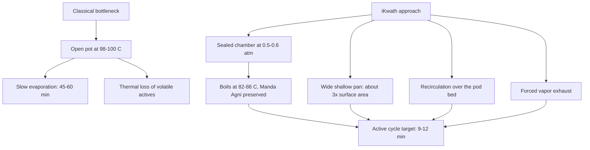
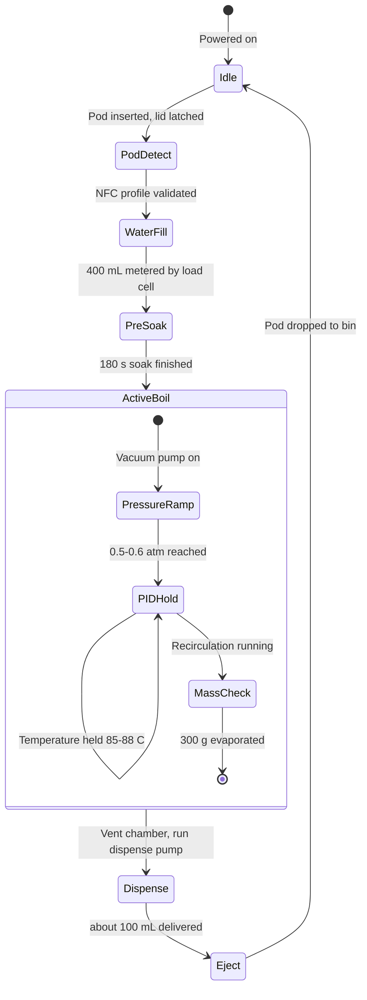

# iKwath: Smart Pod-Based Ayurvedic Decoction Appliance

**SIH26048: iKwath, a pod-based smart Kwatha (Kadha) maker that prepares a fresh, AFI/API-standardized decoction from coarse powder (yavakuta churna) on demand, in the shortest practical time, without altering the decoction's quality or yield**
Ministry of Ayush / All India Institute of Ayurveda (AIIA) | Smart India Hackathon 2026
**Team:** MACH 2
**Design philosophy:** Classical Fidelity | Hardware-Enforced Safety | Measured Endpoints, Not Timers | Honest Project Status

[](https://sih.gov.in)
[](docs/pod-and-extraction.md)
[](docs/README.md)
[](docs/pinout-and-buses.md)
[](docs/pcb-status.md)
[-lightgrey.svg?style=flat-square)](website/)

---

## 1. Problem Statement Context (SIH26048)

Kwatha (also Kashaya or Kadha) is the primary aqueous decoction in Ayurveda. Coarse herbal powder (yavakuta churna) is boiled in a specified multiple of water and reduced, classically to one quarter of the volume, then filtered immediately.

The difficulty is that a classical Kwatha has no preservatives and stays therapeutically useful for only a few hours. Making it properly means 45 to 60 minutes of monitored simmering, so patients and OPD clinics often switch to bottled, industrially preserved syrups that suffer thermal degradation or inconsistent yield.

* **Long manual process:** open-pot evaporation needs constant attention for close to an hour.
* **Temperature ceiling:** classical practice prescribes gentle heat (Manda Agni). At or above 100 C volatile terpenes and thermolabile glycosides degrade.
* **Standardization gap:** hand preparation varies in water ratio, reduction and filtration, so dose consistency is poor.
* **No traceability:** there is no record of what was brewed, from which batch, at what concentration.

---

## 2. Integrated Solution Overview

**iKwath** is a countertop, single-dose extraction appliance built around five ideas:

1. **Pod-based dosing:** a single-use pod holds 25 to 35 g of certified coarse powder and doubles as the filter (150 to 250 micron mesh). An NTAG213 NFC tag on the rim carries the formulation profile.
2. **Vacuum-assisted evaporation:** the sealed SS304 chamber runs at 0.5 to 0.6 atm so water boils at about 82 to 86 C. The liquid boils vigorously while staying inside the 85 to 90 C envelope.
3. **Measured endpoint:** a load cell tracks the mass of the chamber and ends the boil when 300 g (+/- 2 g) has evaporated, an exact 4:1 reduction of 400 mL. The endpoint is a measurement, not a timer.
4. **Three independent hardware safety layers:** fuse, lid interlock and bimetallic thermal cutoff, all working with the firmware switched off.
5. **Companion app and cloud model:** live brew dashboard, pod profile catalogue, dose log and clinic fleet view (see the status note in section 8).

> Scientific and engineering classification: iKwath is a prototype design for a standardized decoction appliance. It is not a certified medical device, and this repository does not contain laboratory validation of extract quality. See section 10 for what is and is not built.

---

## 3. Extraction Physics

The Ayurvedic Formulary of India (AFI) and Ayurvedic Pharmacopoeia of India (API) set water ratio by herb hardness:

| Herb class | Parts | Water ratio (w/w) | Reduction | Concentration |
|---|---|---|---|---|
| Soft (Mridu): leaves, flowers | 16 | 16 | to 1/4 | about 4x |
| Medium (Madhyama): bark, stems | 8 | 8 | to 1/4 | about 2x |
| Hard (Kathina): roots, heartwood | 4 | 4 | to 1/4 | about 1x |

The working profile is 400 mL of water reduced to a 100 mL dose.

Cycle time falls from 45 to 60 minutes to 9 to 12 minutes without raising liquid temperature, using four levers:



Particle size follows PCIM&H specification AFI/2020/KC/1.0: 100 percent through IS sieve 22 (710 micron) and not more than 10 percent through sieve 44 (355 micron). Details: [docs/pod-and-extraction.md](docs/pod-and-extraction.md).

---

## 4. Machine Working Principle



Eight steps: interlocked pod loading, metered water intake, pre-soak, controlled vacuum boil, recirculation with vapor stripping, mass-reduction endpoint, filtered dispense at 55 to 60 C, automatic pod ejection. Step-by-step detail: [docs/control-sequence.md](docs/control-sequence.md).

---

## 5. Repository Layout

```
SIH/
├── README.md                      Main specification and status
├── INSTALL.md                     How to open, run and rebuild each part
├── CHANGELOG.md                   Versioned release notes
├── PUSH_LOG.md                    What each push to the repository did
├── SIH26048_PROJECT_REPORT.md     Full technical submission report
├── ps_shortlist.md                Problem-statement shortlist and selection notes
├── app/                           Product landing site (single page, with media assets)
│   ├── index.html
│   ├── styles.css
│   ├── assets/                    Product, pod and lifestyle imagery, hero video
│   └── _assets_backup/            Unused media with a restore script
├── website/                       Interactive brew-simulator web app (HTML, CSS, JS)
│   ├── index.html
│   ├── styles.css
│   ├── app.js                     Screen state machine, extraction simulator, greetings
│   ├── manifest.json
│   └── assets/
├── pcb/                           Committed KiCad project (control and power circuitry)
│   ├── ikwath.kicad_sch
│   ├── ikwath.kicad_pcb
│   └── ikwath.kicad_pro
├── ino/                           ESP32 firmware (Arduino sketch)
│   └── ikwath_firmware/
│       ├── ikwath_firmware.ino    State machine, sensors, safety checks, serial and optional HTTP
│       ├── pins.h  config.h       Pin map and tunable settings
│       ├── pid.h  hx711_lite.h    Heater PID and load-cell reader
│       └── profile.h              Pod tag payload format
├── models/                        Process model notebook: vacuum boiling, energy budget, endpoint noise, pod tag
│   └── ikwath_process_model.ipynb
├── docs/                          Engineering documentation derived from this repository
│   ├── pod-and-extraction.md
│   ├── control-sequence.md
│   ├── pinout-and-buses.md
│   ├── safety-system.md
│   ├── pcb-status.md
│   ├── bom.md
│   ├── app-and-cloud.md
│   ├── limitations.md
│   ├── judge-qna.md
│   └── README.md
├── blehpcb/                       Local PCB generation work (gitignored)
│   ├── BOM.csv
│   ├── generate_final_kicad8.py
│   ├── ikwath-control-board/  ikwath-power-board/
│   ├── *-drc.rpt  *-erc.rpt       KiCad rule-check reports
│   └── pcbreal/                   Scripted placement, routing and stackup iterations
└── blehread/                      Local research dossiers (gitignored)
    ├── research.md  structure.md  pcb.md  app_and_website.md  names.md  open.md
```

The two gitignored folders are working material that lives only on the author's machine; see [PUSH_LOG.md](PUSH_LOG.md) for what is actually pushed.

---

## 6. Dual-PCB Hardware Architecture

The electronics are split into two boards so that sensitive analog measurement is isolated from inductive relay switching.

```mermaid
graph LR
    subgraph Power Board
        AC[220V AC] --> PS1[12V 5A AC-DC supply]
        PS1 --> F1[5A DC fuse]
        F1 --> V12[12V bus]
        V12 --> BUCK[LM2596 buck to 5V]
        V12 --> RLY[Relays 1-7: heater, vacuum pump, recirculation pump, dispense pump, inlet valve, lid lock, exhaust fan]
    end

    subgraph Control Board
        MCU[ESP32 DevKit V1]
        MCU --> DS[DS18B20 liquid temperature]
        MCU --> HX[HX711 + load cell]
        MCU --> NFC[MFRC522 NFC reader]
        MCU --> I2C[I2C bus]
        I2C --> OLED[SSD1306 OLED]
        I2C --> BMP[BMP280 pressure]
        I2C --> PCF[PCF8574 x2: relays, LEDs]
        MCU --> TDS[Analog TDS sensor]
        MCU --> SW[Limit switches: lid, boil-over, level]
        MCU --> SRV[SG90 pod ejector]
    end

    BUCK -- 5V --> MCU
    Power Board <-->|Ribbon: power, I2C, PID, signals| Control Board
```

| Board | Target size | Notes |
|---|---|---|
| Control | 70 x 60 mm in the specification (generated variants are larger, see [docs/pcb-status.md](docs/pcb-status.md)) | 2-layer, dedicated analog ground zone, 4x M3 |
| Power | 80 x 70 mm in the specification | 2-layer, heavy power traces, opto-isolated relay drive, 4x M3 |

Pin map and I2C addresses: [docs/pinout-and-buses.md](docs/pinout-and-buses.md).

---

## 7. Three-Tier Hardware Safety System

These layers act independently of firmware:

1. **Bimetallic thermal cutoff (95 to 100 C)**, in contact with the boiler wall and in series between Relay 1 and the heater. If the chamber overheats for any reason, including a welded relay, it opens the circuit.
2. **Mechanical lid interlock**, wired in series with the heater's 12 V feed. Opening the lid cuts heater power in hardware.
3. **5 A fast-acting fuse** on the 12 V rail against short circuits and pump stall.

The firmware in `ino/` adds supervisory checks on top (boil-over sensor, water level, enclosure NTC, over-temperature, timeouts); it is a first draft that has not yet run on the appliance (section 10). Details: [docs/safety-system.md](docs/safety-system.md).

---

## 8. Companion Applications

Two web front ends are in the repository. Both run with no build step and no dependencies.

| Folder | What it is |
|---|---|
| `website/` | Interactive mobile-style app: logo intro, login, time-based greeting, pod dropdown (Triphala, Ayush, Dashamoola), five-stage extraction simulator with live countdown, temperature dial, 400 to 100 mL gauge and a PID curve pinned to the 85 to 90 C band, notification bell, pod scanner viewfinder, profile view, Android frame toggle |
| `app/` | Single-page product site: appliance, pods, app, formulations, science and standards sections, sign-in and sign-up modals, product photography and hero video |

**Status:** the extraction screen is a simulator driven by `website/app.js`. It does not connect to a device. The BLE provisioning, local WebSocket, MQTT telemetry and cloud database described in [docs/app-and-cloud.md](docs/app-and-cloud.md) are the intended architecture, not running code.

---

## 9. Bill of Materials

`blehpcb/BOM.csv` lists 46 line items (ESP32, sensors, NFC reader, display, expanders, 7 relays, pumps, valves, heater, servo, fan, safety parts, passives and connectors). The file's own total row, and the sum of its cost column, is **INR 4,588** (about US$55), reading each figure as a line total. If those were unit prices the bill would be INR 8,335, so spot-check a few lines against supplier listings before quoting a cost. Full table and notes: [docs/bom.md](docs/bom.md).

---

## 10. Project Status: Built Versus Designed

| Area | Status |
|---|---|
| Problem analysis, extraction physics, pod design | Written (`blehread/research.md`, `docs/pod-and-extraction.md`) |
| Pin-by-pin hardware specification | Written (`blehread/pcb.md`, `docs/pinout-and-buses.md`) |
| KiCad schematic and PCB | Present in several iterations; `pcb/` is the committed one. Rule-check results vary by iteration, and copper routing is incomplete in some (see [docs/pcb-status.md](docs/pcb-status.md)) |
| Web front ends | Built and runnable; extraction is simulated |
| ESP32 firmware | Written (`ino/`): full cycle, safety checks, serial and optional HTTP interface. Not yet compiled here or run on hardware |
| Physical prototype and lab validation | **Not done** (no measured extract quality, no measured cycle time) |
| Mobile app, cloud backend, MQTT | **Design only** |

The 9 to 12 minute cycle, the 85 to 90 C envelope and the 300 g endpoint are design targets derived from the physics, not measured results. An energy balance in `models/ikwath_process_model.ipynb` shows that the cycle time is set by heater power: the 50 W element in the current bill of materials is far too small for a 12 minute cycle, so the heater is an open design decision. [docs/limitations.md](docs/limitations.md) lists what is needed to turn each into a measured claim.

---

## 11. Documentation Map

| Document | Contents |
|---|---|
| [SIH26048_PROJECT_REPORT.md](SIH26048_PROJECT_REPORT.md) | Full technical submission report |
| [INSTALL.md](INSTALL.md) | Run the web apps, open the PCB, regenerate boards |
| [CHANGELOG.md](CHANGELOG.md) | Versioned release notes |
| [PUSH_LOG.md](PUSH_LOG.md) | What each push did |
| [ino/README.md](ino/README.md) | Firmware structure, cycle, safety checks, serial commands |
| [docs/](docs/README.md) | Engineering documentation set |

---

## 12. Authoritative Standards and Citations

* PCIM&H, *AFI/2020/KC/1.0: Formulary Specification of AYUSH Kvatha Churna*, Ghaziabad.
* PCIM&H, *API-2/2020/KC/1.0: Pharmacopoeial Monograph of AYUSH Kvatha Churna*, Ministry of Ayush.
* *The Ayurvedic Pharmacopoeia of India*, Parts I and II, First Edition, Ministry of Health and Family Welfare / Ministry of Ayush.
* All India Institute of Ayurveda (AIIA): guidance on quality control, good dispensing practice and clinical standardization of extemporaneous decoctions.

---

*iKwath, Smart India Hackathon 2026, Ministry of Ayush / AIIA*
*Team: MACH 2*
