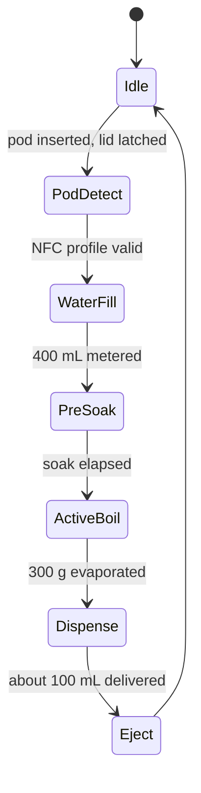

# iKwath: Technical Project Report
## Smart Pod-Based Ayurvedic Decoction Appliance (Kwatha / Kadha Maker)

```
========================================================================================
PROJECT IDENTITY AND METADATA
========================================================================================
Hackathon:            Smart India Hackathon 2026 (SIH 2026)
Problem Statement ID: SIH26048
Organization:         Ministry of Ayush / All India Institute of Ayurveda (AIIA)
Category:             Hardware / MedTech / BioTech / HealthTech
Team:                 MACH 2
Report version:       0.4.0
Date:                 September 2026
Repository state:     3 commits on 2026-09-21 plus a documentation pass
What is built:        Specification, KiCad PCB iterations, two runnable web front ends
Firmware:             Drafted in ino/, not yet run on hardware
What is not built:    Physical prototype, laboratory validation
========================================================================================
```

## Table of Contents
1. Executive Summary
2. Problem Statement Analysis
3. Extraction Physics and Design Approach
4. Pod Architecture
5. Machine Fluidics and Working Principle
6. Electronics Architecture
7. Safety Design
8. Process Control and Endpoint Detection
9. Applications and IoT Design
10. Verification and Current Status
11. Bill of Materials and Economics
12. Limitations and Roadmap
13. Conclusion

---

## 1. Executive Summary

Kwatha is the principal aqueous decoction of Ayurveda: coarse herbal powder boiled in a multiple of water, reduced classically to one quarter and filtered at once. It has no preservatives and is therapeutically useful for only a few hours, yet preparing it properly takes 45 to 60 minutes of attended simmering. People therefore turn to bottled syrups that degrade or vary in strength.

**iKwath** is a countertop, single-dose appliance that aims to prepare a fresh, standardised Kwatha from a sealed pod in about 9 to 12 minutes. It relies on vacuum-assisted boiling (0.5 to 0.6 atm, boiling near 82 to 86 C) so the liquid stays inside the 85 to 90 C classical envelope, a wide shallow pan with recirculation and vapor exhaust for speed, an NFC-coded pod that carries the brew profile, and a load-cell endpoint that ends the boil after exactly 300 g of evaporation from 400 g of water.

The design is split across two PCBs (control and power), protected by three hardware safety layers that work without firmware, and paired with two web front ends that present the product and simulate the brew.

This report separates what is designed from what is built. The specification, the PCB files, the firmware draft and the web apps exist. A working prototype and any measurement of cycle time or extract quality do not yet exist, and the firmware in `ino/` is a first draft that has not yet run on the appliance.

---

## 2. Problem Statement Analysis

| Issue | Detail |
|---|---|
| Short shelf life | Classical Kwatha lasts hours, not days |
| Long preparation | 45 to 60 minutes of monitored simmering |
| Heat sensitivity | Above 100 C volatile terpenes and thermolabile glycosides degrade |
| Variability | Manual ratio, reduction and filtration differ from cook to cook |
| No records | No batch, concentration or dose traceability |

The problem statement asks for a pod-based smart maker that produces an AFI/API-standardised decoction from coarse powder on demand, quickly, without altering quality or yield.

---

## 3. Extraction Physics and Design Approach

### 3.1 Pharmacopoeial parameters
| Herb class | Water ratio (w/w) | Reduction |
|---|---|---|
| Soft (leaves, flowers) | 16 | to 1/4 |
| Medium (bark, stems) | 8 | to 1/4 |
| Hard (roots, heartwood) | 4 | to 1/4 |

Working profile: 400 mL reduced to 100 mL.

### 3.2 Particle size
PCIM&H AFI/2020/KC/1.0: all material through IS sieve 22 (710 micron) and no more than 10 percent through IS sieve 44 (355 micron), so the bed stays permeable and fines do not clog the mesh.

### 3.3 Speed without heat
| Lever | Effect |
|---|---|
| Reduced pressure, 0.50 to 0.60 atm | boiling point about 81 to 86 C, vigorous boil inside the envelope |
| Wide shallow pan, 150 to 200 cm2 | about three times the evaporating surface of a tall pot |
| Vapor exhaust | removes saturated air above the liquid |
| Recirculation over the pod bed | removes diffusion boundary layers and hot spots |

The 9 to 12 minute cycle is the design target implied by these levers. It has not been measured.

---

## 4. Pod Architecture

* Charge: 25 to 35 g of coarse powder.
* Filter: integrated mesh, 150 to 250 micron.
* Shell: food-grade polypropylene or pressed cellulose, BPA-free, rated to 100 C in water.
* Identity: NTAG213 NFC tag (13.56 MHz) read by an MFRC522.
* Tag payload (design): formulation ID, water ratio class, pre-soak time (180 to 300 s), target evaporated mass, temperature setpoint (85 to 88 C), target extract density.

Detail: `docs/pod-and-extraction.md`.

---

## 5. Machine Fluidics and Working Principle



Eight steps: interlocked loading, metered water intake, pre-soak, vacuum boil under PID, recirculation with vapor stripping, mass-based endpoint, filtered dispense at 55 to 60 C, and servo pod ejection. Seven relays drive the heater, vacuum pump, recirculation pump, dispense pump, inlet valve, lid lock and exhaust fan. Detail: `docs/control-sequence.md`.

---

## 6. Electronics Architecture

Two boards isolate measurement from switching.

| Board | Function | Contents |
|---|---|---|
| Control | Sensing, logic, display | ESP32 DevKit V1; DS18B20; HX711 with load cell; MFRC522; BMP280; analog TDS sensor; 10 kOhm NTC; SSD1306 OLED; two PCF8574 expanders; three limit switches; four status LEDs; buzzer; SG90 servo |
| Power | Mains conversion and actuation | 12 V 5 A AC-DC supply; 5 A fuse; LM2596 buck to 5 V; seven opto-isolated relays; heater safety wiring |

Pin map, I2C addresses (0x3C OLED, 0x76 BMP280, 0x20 and 0x21 expanders) and relay table: `docs/pinout-and-buses.md`.

---

## 7. Safety Design

Three layers act independently of firmware: a bimetallic cutoff (95 to 100 C) on the boiler wall in series with the heater; a lid interlock in series with the heater feed; and a 5 A fuse on the 12 V rail. The firmware is specified to add boil-over, water-level, enclosure-temperature and liquid-temperature supervision. Detail and gaps: `docs/safety-system.md`. No electrical or medical-device certification has been attempted, and no independent mains-side review has been done.

---

## 8. Process Control and Endpoint Detection

* Heater temperature is held by PID at the pod-profile setpoint (85 to 88 C).
* Chamber pressure is monitored by the BMP280 against the 50 to 60 kPa target.
* The endpoint is delta_m = m0 - m(t) = 300 g (+/- 2 g), which represents the 4:1 reduction of 400 mL, measured by the load cell.
* A TDS sensor logs conductivity against the formulation's baseline curve as a consistency proxy. It does not replace laboratory fingerprinting.

Open engineering questions: load-cell behaviour under vacuum, vacuum control law and vent timing, and failure handling (dry boil, lid opened mid-cycle, unreadable tag).

---

## 9. Applications and IoT Design

### 9.1 Built
* `website/`: interactive app with logo intro, greeting, pod selection (Triphala, Ayush, Dashamoola), five-stage extraction simulator, temperature curve pinned to the 85 to 90 C band, notification bell, pod scanner viewfinder, profile screen, Android frame toggle.
* `app/`: one-page product site with product imagery and a hero video.
Both are dependency-free HTML, CSS and JavaScript, and neither connects to hardware.

### 9.2 Designed
BLE provisioning, a local WebSocket for offline control, MQTT telemetry for clinic fleets, a formulation catalogue mapped to NFC tag IDs, and a dose compliance log. Detail: `docs/app-and-cloud.md`.

---

## 10. Verification and Current Status

| Item | Status | Evidence |
|---|---|---|
| Specification and physics | Written | README, `docs/`, research notes |
| Web apps | Run in a browser | `website/`, `app/` |
| KiCad electrical rules | Run on the generated iterations; no electrical-rule errors reported | `blehpcb/*-erc.rpt` |
| KiCad design rules | Run on several iterations; final clean-up before fabrication is pending | `docs/pcb-status.md` |
| Committed board (`pcb/`) | routed copper present; no stored rule report | `pcb/ikwath.kicad_pcb` |
| Firmware | Drafted (`ino/`); not yet compiled here or run on hardware | `ino/ikwath_firmware/` |
| Prototype and lab tests | not done | none |

Detail on the board iterations: `docs/pcb-status.md`.

---

## 11. Bill of Materials and Economics

The bill (`blehpcb/BOM.csv`, 46 numbered items) totals **INR 4,588** (about US$55) by its own total row, reading the cost column as line totals; INR 8,335 if those were unit prices. Excluded: enclosure, SS304 chamber, tubing, fittings, pod tooling, PCB fabrication and food-grade upgrades of contact parts. Full table: `docs/bom.md`.

No unit-economics analysis (pod cost, price, margin) exists in the repository.

---

## 12. Limitations and Roadmap

### 12.1 Limitations
Firmware untested; no prototype; no extract-quality data; simulated app; design-only cloud; PCB not finalised; prototype-grade BOM; vacuum-and-load-cell interaction untested; mains side unreviewed; repository hygiene items open. The full list with remedies is in `docs/limitations.md`.

### 12.2 Roadmap
1. Choose the final PCB variant, fix footprints, complete routing, store DRC and ERC results.
2. Compile, bench-test and calibrate the firmware in `ino/` (eight-step cycle and safety supervision).
3. Build the chamber and log full cycles of temperature, pressure and mass.
4. Send extracts to a certified lab and compare with hand-prepared Kwatha.
5. Connect the web app to the device over WebSocket, then add BLE provisioning and MQTT.
6. Source certified formulation profiles and food-grade contact parts.

---

## 13. Conclusion

iKwath addresses a real gap: fresh, correctly reduced Kwatha in minutes rather than an hour, without exceeding classical gentle heat. The approach (vacuum boiling, NFC-coded pods, mass-based endpoint, hardware-first safety) is grounded in the pharmacopoeial parameters and is documented in detail. What remains is to turn design targets into measurements: firmware, a working prototype and laboratory results.

*iKwath, Smart India Hackathon 2026, Ministry of Ayush / AIIA. Team MACH 2.*
