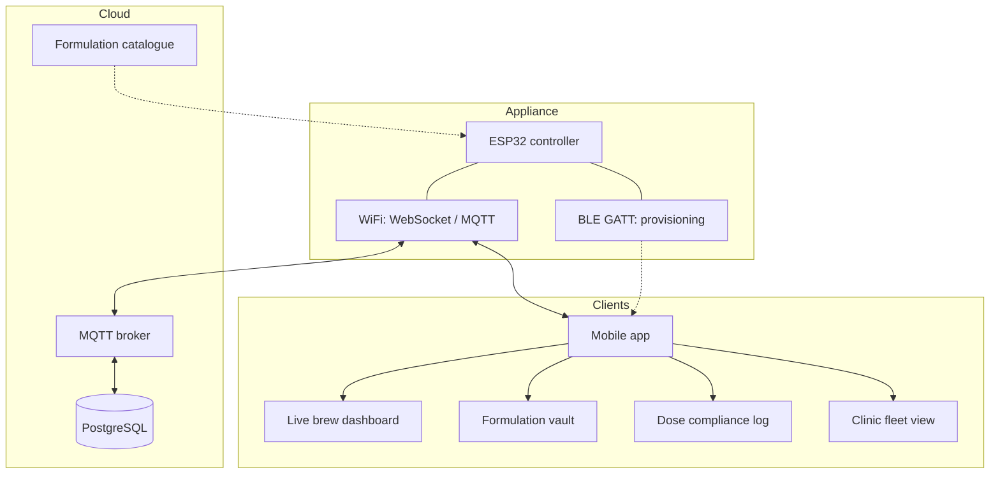

# Applications and cloud

## What exists today

| Folder | Contents | Connects to a device? |
|---|---|---|
| `website/` | Mobile-style interactive app: `index.html` (screens, tabs, modals), `styles.css`, `app.js` (state machine, extraction simulator, greetings), `manifest.json` | No. Extraction is simulated in the browser |
| `app/` | One-page product site: appliance, pods, app, formulations, science, standards, sign-in and sign-up modals, product imagery and video | No |

Both use plain HTML, CSS and JavaScript with no dependencies and no build step.

### Behaviour of `website/`

* Logo intro that blurs into a login screen.
* Time-based greeting (morning, afternoon, evening, night).
* Active pod card that expands to switch between Triphala, Ayush and Dashamoola Kadha.
* Five-stage extraction: Soak, 85 C Boil, Reduce 4:1, Filter, Dispense, with a countdown, temperature dial, 400 to 100 mL gauge and a canvas curve pinned to the 85 to 90 C band.
* Notification bell, pod scanner viewfinder simulation, profile screen, Android frame toggle for screenshots.
* Profile and account values are placeholders.

## Intended architecture (design only)

| Concern | Design |
|---|---|
| Pairing | BLE for first-time WiFi credential hand-off |
| Local control | WebSocket between phone and ESP32 on the same network, working without internet |
| Fleet telemetry | MQTT topic `device/{id}/telemetry`, published about every second |
| Pod profiles | NFC tag ID mapped to a certified formulation record cached on the phone |
| Records | batch number, extraction metrics and timestamp per dose for clinics |
| Manual profiles | advanced mode with an explicit "unverified profile" warning |

## What is missing to make it real

1. Firmware BLE service, WebSocket and MQTT topics. The sketch in `ino/` has an optional HTTP status and control interface (`/status`, `/start`, `/stop`); BLE and MQTT are not implemented.
2. A mobile client (React Native or Flutter) or wrapping the web app as a PWA (the manifest exists).
3. A backend and database for profiles and dose logs.
4. A certified formulation source; profiles today are illustrative.
