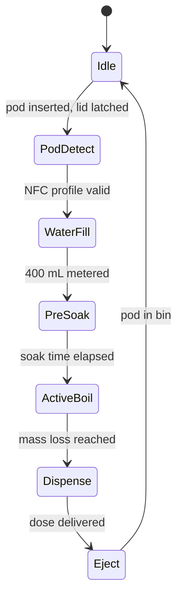

# Control sequence

The machine cycle. A first-draft implementation is in [`ino/`](../ino/README.md); it has not yet run on the appliance, so this document remains the specification the firmware is checked against.

## State machine

## Steps

| # | Step | Actuators and sensors | Exit condition |
|---|---|---|---|
| 1 | Pod loading and interlock | limit switch, lid-lock solenoid (Relay 6) | lid closed and locked; NFC tag read |
| 2 | Water intake | inlet solenoid (Relay 5), HX711 load cell | 400 mL (or profile volume) by mass |
| 3 | Pre-soak | none active | 180 to 300 s per profile |
| 4 | Vacuum boil | heater (Relay 1, PID), vacuum pump (Relay 2), BMP280, DS18B20 | about 55 kPa reached; liquid held at 85 to 88 C |
| 5 | Recirculation and vapor stripping | recirculation pump (Relay 3), exhaust fan (Relay 7) | runs during the boil |
| 6 | Endpoint detection | load cell | 300 g (+/- 2 g) evaporated |
| 7 | Filter and dispense | dispense pump (Relay 4) | about 100 mL delivered at 55 to 60 C |
| 8 | Eject | SG90 servo | pod dropped to waste bin |

## Endpoint by mass

The boiler sits on a straight-bar load cell read by the HX711. With initial water mass m0, the loss is delta_m = m0 - m(t). At delta_m = 300 g (+/- 2 g) the 4:1 reduction is complete and the cycle ends. This replaces a fixed timer, so the endpoint tracks the actual evaporation rate.

## PID and supervisory checks

* Heater: PID drive on GPIO14 to hold the setpoint from the pod profile (85 to 88 C).
* Firmware supervision (specified): lid sense on GPIO25, boil-over on GPIO26, reservoir level on GPIO33, enclosure NTC on GPIO32, over-temperature on the DS18B20.
* Hardware protection does not depend on any of these; see [safety-system.md](safety-system.md).

## Items firmware must settle

* Load-cell calibration and tare handling with the chamber under vacuum (buoyancy and hose forces).
* Vacuum control law (bang-bang or proportional) and vent timing before dispense.
* Failure states: dry boil, lid opened mid-cycle, tag unreadable, sensor out of range.
